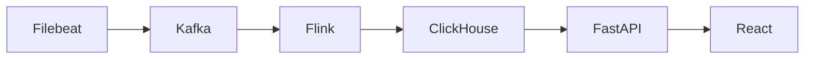

# Log AI Assistant

本项目是一个面向企业安全日志分析的 AI 助手原型。

项目目标是构建从日志采集、结构化处理、ClickHouse 存储、行为基线建模、异常检测、AI 研判反馈到前端工作台的完整安全分析系统。

它将企业安全日志转化为带有规则、行为基线和关联证据的异常事件，供分析人员在统一工作台中研判与追踪。

## 一图看懂



主链路由 Filebeat 采集日志，经 Kafka 和 Flink 规范化后写入 ClickHouse；FastAPI 对外提供业务 API，React 工作台负责展示。ClickHouse 是当前唯一的主存储和分析引擎。

## 5 分钟体验

1. 准备环境并启动完整主链路：

   ```bash
   cp .env.example .env
   docker compose up --build
   ```

2. 打开 [前端工作台](http://localhost:5173)，查看日志、异常事件、用户画像、AI 研判和安全态势相关页面。
3. 打开 [系统状态接口](http://localhost:8000/api/v1/health)，确认 Kafka、Flink、ClickHouse 等服务状态。默认的 `log-generator` 会向 `logs/` 写入小流量多源样例日志，供主链路处理。

## 验证方式

快速执行项目测试：

```bash
docker compose run --rm tester
```

该测试只覆盖快速、局部验证，不能替代完整 Docker 验收。完整验收命令见 [`docs/11_operations_and_acceptance_spec.md`](docs/11_operations_and_acceptance_spec.md)，以下序列中的端到端检查、运营任务和场景评测都需要执行：

其中必需的 `SKIP_COMPOSE_UP=1 scripts/p0_e2e_check.sh` 使用 POSIX 环境变量赋值和 Bash 脚本；Windows 用户请在 WSL 或 Git Bash 中执行，不能直接在 PowerShell 中运行。

```bash
docker compose run --rm tester
docker compose up -d --build
SKIP_COMPOSE_UP=1 scripts/p0_e2e_check.sh
docker compose run --rm operations-runner run-once --task data_quality_reconcile
docker compose run --rm operations-runner run-once --task baseline_rebuild
docker compose run --rm operations-runner run-once --task daily_report_generate
docker compose run --rm operations-runner run-once --task scenario_evaluate
```

## 项目范围与 AI 边界

本项目聚焦安全日志采集、结构化处理、行为建模、异常检测、证据化研判和运营验收，不是自主执行安全处置的系统。AI 只对已筛选的高可疑 `AnomalyEvent` 证据包提供研判和建议：它不分析全量原始日志、不单独决定异常是否成立，也不会自主执行封禁、阻断等处置动作。任何可能影响规则或有效 baseline 的反馈，都必须经人工审核并保留审计记录。

## My Contribution / 共创说明

本项目为团队共创项目。我在项目中主要负责 **异常检测链路（A 模块）**，核心工作集中在：

- 将已经标准化入库的 `security_logs` 转换为可供前端、AI 研判和运营日报使用的 `anomaly_events`。
- 设计并实现基于 `RuleEngine` 的异常规则判断，包括登录失败聚集、凭证填充、新来源 IP、非工作时间登录、敏感资源访问、横向移动、大量下载/导出等场景。
- 参与定义异常事件数据结构，覆盖 `risk_level`、`risk_score`、`reason_codes`、`rule_hits`、`baseline_deviations`、`evidence`、`related_event_ids` 和 `ai_status` 等字段。
- 将规则强度、行为基线偏离、敏感行为、事件关联和反馈修正纳入风险评分，让检测结果不只是“命中规则”，而是能解释、能排序、能进入后续 AI 研判。
- 打通 `ClickHouse security_logs -> anomaly-detector -> anomaly_events -> frontend / AI judgement / reports` 的中间链路，支撑团队其他成员的数据展示、研判和闭环反馈工作。

这段工作让我完整参与了一个从日志流处理到安全异常事件建模的后端工程链路，也锻炼了我把规则检测、行为基线、风险评分和可解释证据包结合到实际系统中的能力。

## 可复现异常检测演示

### 本地证据摘要

在不配置模型 Key、不连接 Kafka 或 ClickHouse 的情况下，可以输出一份固定合成场景的简短证据摘要：

```bash
python -m scripts.run_evidence_demo_brief
```

同一内容也可通过 `GET /api/v1/demo/evidence-brief` 获取。它只说明合成场景、规则覆盖、正常对照和一次 API 审核回放；不读取真实日志、不调用模型，也不代表生产检测准确率或 SOC 研判结论。

我负责的 A 模块可以独立用一组固定、脱敏的场景复跑：

```text
安全日志样例 -> RuleEngine -> AnomalyEvent -> FastAPI GET /api/v1/anomalies
```

场景定义位于 `tests/fixtures/reproducible_anomaly_scenarios_v1.json`，仅使用虚拟账号、资源名与 TEST-NET 保留网段。场景覆盖：登录失败突增、凭证填充、高频 API 调用、敏感资源访问、新来源登录后敏感访问，以及两类正常行为对照。每项都声明输入序列、预期 `risk_level`、`reason_codes`、`evidence` 和 `related_event_ids`；测试会用真实 `RuleEngine` 生成 `AnomalyEvent`，再经 FastAPI 查询路由校验返回契约。

运行最小演示：

```bash
docker compose run --rm tester pytest -q tests/test_reproducible_anomaly_scenarios.py
```

该测试是固定规则样例的回归验证，不代表模型准确率、真实企业数据效果或生产性能。完整系统启动后可通过以下接口查看已入库的异常事件：

```bash
curl http://localhost:8000/api/v1/health
curl "http://localhost:8000/api/v1/anomalies?limit=20"
```

阶段 2 的场景验收、稳定 ID、增量读取、warmup 与去重验证见 `docs/13_detection_acceptance_report.md`。其中明确区分已验证的 A 模块行为与尚未进行的集群负载验证。

### 3 分钟面试演示

```bash
docker compose build tester
docker compose run --rm tester python scripts/run_anomaly_demo.py
```

该命令不读取线上日志、不调用外部 API，只输出固定脱敏场景的 JSON 验收结果：场景名、输入数量、规则原因码、风险等级、稳定 `anomaly_id`、去重结果，以及 FastAPI 查询模型返回的证据。重点可查看登录失败突增、凭证填充、高频 API、正常对照和重复异常事件去重。它只展示我负责的异常检测 A 模块，不代表团队全链路由我独立实现。

面试演示步骤见 [`docs/14_interview_demo.md`](docs/14_interview_demo.md)，最近一次合成场景的终端证据见 [`docs/evidence/anomaly-demo-v1.md`](docs/evidence/anomaly-demo-v1.md)。

### 60 秒面试讲解

1. 固定的脱敏安全日志先进入我负责的 `RuleEngine`，再由 `AnomalyEventBuilder` 生成异常事件；我会展示登录失败突增或凭证填充的输入与命中原因码。
2. 事件带有由输入与规则派生的稳定 `anomaly_id`、`evidence` 和 `related_event_ids`；worker 会用这些 ID 对重放事件去重，API 返回同一份可解释证据。
3. 演示中可用人工复核接口把某个异常标记为 `pending`、`confirmed` 或 `false_positive` 并附备注。该接口是无账号、进程内的演示实现，重启 API 后记录清空；Kafka、Flink、ClickHouse 和前端属于团队全链路，并非我个人独立开发。

### 演示级人工复核

对演示中得到的任一 `anomaly_id`，可记录和查询一条人工复核标签：

```bash
curl -X PUT "http://localhost:8000/api/v1/anomalies/<anomaly_id>/review" \
  -H "Content-Type: application/json" \
  -d '{"status":"confirmed","reviewer_note":"Synthetic demo review.","reviewer":"demo-analyst"}'
curl "http://localhost:8000/api/v1/anomalies/<anomaly_id>/review"
```

这是面试演示用的进程内记录，不替代现有 ClickHouse `ai_feedback` 治理表，也没有账号、权限或跨重启持久化能力。

复核记录会从已有异常事件复制 `anomaly_id`、`reason_codes` 和结构化 `evidence` 快照；`raw_log`、`message` 等原始文本字段会在写入演示复核记录前移除。

### 3 分钟安全研判演示

`Investigation Pack` 把我负责的异常事件、证据、去重和演示级人工复核组合为一条可演示闭环，不读取真实日志或外部 API：

```bash
docker compose build tester
docker compose run --rm tester python scripts/run_investigation_pack.py --format markdown
```

1. 输出先显示固定脱敏日志如何命中异常，及稳定 `anomaly_id` 和重复重放去重。
2. 对 `failed-login-user-spike` 或 `credential-stuffing`，调用 `GET /api/v1/anomalies/<anomaly_id>/investigation` 查看脱敏证据、规则阈值、关联事件和人工维护的窄范围 ATT&CK 引用。
3. 用 `PUT /api/v1/anomalies/<anomaly_id>/review` 标记 `confirmed` 或 `false_positive`，再查询研判接口查看复核状态。

研判包是无账号、进程内的演示实现，复核记录不跨进程持久化；脱敏是演示输出保护，不能替代企业级权限、密钥管理或完整 SIEM/SOC 能力。最近一次真实终端输出见 [`docs/evidence/investigation-pack-v1.md`](docs/evidence/investigation-pack-v1.md)。开源参考、许可证与未复制声明见 [`THIRD_PARTY_NOTICES.md`](THIRD_PARTY_NOTICES.md)。

### 一键面试回放与 API 集合

```bash
docker compose build tester
docker compose run --rm tester python scripts/run_interview_investigation_demo.py --format markdown
```

该入口在同一进程内依次完成固定脱敏日志的规则检测、稳定 ID/去重检查、`GET /investigation` 查询以及一次 `pending -> confirmed` 的真实 FastAPI 复核回放。输出只保留规则命中、脱敏证据、ATT&CK 引用和复核状态；不读取线上日志或外部密钥。启动完整 API 后，可导入 [`postman/log-ai-investigation-demo.postman_collection.json`](postman/log-ai-investigation-demo.postman_collection.json) 来调用固定回放、研判查询和 `confirmed` / `false_positive` 复核。`anomalyId` 需要替换为已入库异常 ID；固定回放本身不把样例写入生产存储。

最近一次本地脱敏证据提供 [Markdown](docs/evidence/interview-investigation-demo.md) 和 [JSON](docs/evidence/interview-investigation-demo.json) 两种格式；固定 `anomaly_id`、原因码和脱敏字段由回归测试交叉校验。CI 会生成并上传同类 JSON/Markdown evidence artifact。60 秒讲解：我负责的 Python A 模块把日志转为可解释异常事件；稳定 `anomaly_id` 用于幂等去重，证据和 ATT&CK 映射用于人工核查，最后通过演示级复核接口闭环。Kafka、Flink、ClickHouse 和前端仍是团队全链路，不宣称为我独立开发。该次证据在本地 Python fallback 中生成；Docker Desktop daemon 未运行，因此不宣称为 Docker-backed 结果。

### 规则回归报告

```bash
docker compose build tester
docker compose run --rm tester python scripts/run_rule_regression.py
```

该命令从同一份 10 条脱敏场景生成 JSON：规则类别、去标识化输入摘要、期望风险/原因码/证据、实际输出、期望命中数和通过状态。它是固定样例的规则回归约束，不是检测准确率或真实攻击检出率。

### 统一回放评测

```bash
docker compose build tester
docker compose run --rm tester python scripts/run_detection_evaluation.py
```

该入口把规则回归、稳定 `anomaly_id`、API 证据和逐场景重放去重组合为一份 JSON 报告。每个场景都含不包含原始日志正文的 `trace_id`、输入数、预期/实际规则、风险、异常 ID、原因码、证据、去重结果和通过状态。最近一次终端证据见 [`docs/evidence/detection-evaluation-v1.md`](docs/evidence/detection-evaluation-v1.md)。

## 当前主链路

Filebeat -> Kafka -> Flink -> ClickHouse -> FastAPI -> React

ClickHouse 是当前唯一主存储和分析引擎。
Elasticsearch 不再作为当前目标形态的一部分。

## 正式目标文档

当前项目目标形态、架构约束、数据契约、行为建模方式、AI 使用边界和最终质量标准以 `docs/` 为准。

建议优先阅读：

- `docs/00_project_baseline.md`
- `docs/02_architecture_overview.md`
- `docs/03_data_contract.md`
- `docs/04_clickhouse_schema.md`
- `docs/05_behavior_modeling_spec.md`
- `docs/06_detection_and_scoring_spec.md`
- `docs/07_ai_judgement_feedback_spec.md`
- `docs/09_data_generation_and_scenarios.md`
- `docs/10_final_quality_criteria.md`
- `docs/11_operations_and_acceptance_spec.md`

## 文档索引

完整文档索引见：

- `docs/README.md`

架构决策记录见：

- `docs/adr/README.md`

## 正式运行环境

项目正式运行环境以 Docker Compose 为准。开发者本机只要求安装：

- Git
- Docker / Docker Compose
- 编辑器
- 浏览器

不要求组员本机安装 Miniconda、Python、Node、Flink、Kafka、ClickHouse 或 Filebeat。本地 Python、Node 或 Conda 环境只能作为个人开发便利，不作为项目正式运行依赖。

## Docker-first 启动

首次启动：

```bash
cp .env.example .env
docker compose up --build
```

如果宿主机配置的 Docker Hub 镜像源不可用，构建可能在 `python:3.11-slim`、`node:20-alpine` 等基础镜像 metadata 阶段失败。此时在 `.env` 中把 `PYTHON_BASE_IMAGE`、`NODE_BASE_IMAGE` 或 `KAFKA_IMAGE`、`CLICKHOUSE_IMAGE`、`FLINK_IMAGE`、`FILEBEAT_IMAGE` 改为当前网络可访问的镜像地址，或改为本机已预拉取并重新 tag 的镜像名。

默认 Compose 会拉起当前正式运行基线中的主要服务：

| 服务 | 作用 | 默认访问 |
| --- | --- | --- |
| `kafka` | 流式传输和缓冲层 | `localhost:9092` |
| `flink-jobmanager` / `flink-taskmanager` | Flink 运行环境 | `http://localhost:8081` |
| `flink-submit` | 提交正式 `raw_logs -> parsed_logs` Flink 作业 | 容器内运行 |
| `clickhouse` | 主存储和分析引擎 | `http://localhost:8123` |
| `clickhouse-migrate` | 幂等应用 ADR-010 等增量表结构 | 一次性容器 |
| `filebeat` | 采集 `logs/*.log` 并写入 Kafka `raw_logs` | 容器内运行 |
| `anomaly-detector` | 持续检测 `security_logs` 并写入 `anomaly_events` | 容器内运行 |
| `backend` | FastAPI API 层 | `http://localhost:8000` |
| `frontend` | React + Vite 工作台 | `http://localhost:5173` |
| `log-generator` | 小规模持续生成多源日志样例 | 写入 `logs/` |

默认启动包含 Flink，以保持正式主链路为 `Filebeat -> Kafka -> Flink -> ClickHouse -> FastAPI -> React`。Elasticsearch 和 Kibana 仅在 `legacy-es` profile 中，不进入默认主链路。

如果 `flink:1.18.1` 在当前网络不可拉取，可以在 `.env` 中把 `FLINK_IMAGE` 改为可访问镜像地址，或先在本机预拉取后重新 tag 为 `flink:1.18.1`。

如果使用 Docker Desktop 或脚本执行“拉取全部服务镜像”，可能会触发 legacy profile 中的服务。只拉取默认运行链路时，显式指定服务更稳：

```bash
docker compose pull kafka kafka-init clickhouse filebeat backend frontend log-generator
docker compose up --build kafka kafka-init clickhouse log-generator filebeat flink-jobmanager flink-taskmanager flink-submit anomaly-detector backend frontend
```

默认日志生成器是小流量开发配置，避免压垮普通开发机。大规模日志生成不随默认启动运行，需要显式启用 profile：

```bash
docker compose --profile scale up --build
```

`scale` profile 默认生成速率为 `25 条/秒`，约 `1500 条/分钟`。按当前多源 JSON 日志平均约 700B/条估算，约等于 `1.5GB/day` 原始日志量；如果需要更贴近 `1GB/day`，可在 `.env` 中设置 `LOG_GENERATOR_SCALE_BATCH_SIZE=17`。

默认启动通过 Flink 作业把 `raw_logs` 规范化成 `parsed_logs`，ClickHouse 通过 Kafka 引擎表把 `parsed_logs` 落入 `security_logs`。

`anomaly-detector` 默认每 1 秒执行一轮、每轮最多读取 2000 条日志，用于跟上 scale profile 的数据速率。若检测仍滞后，可继续调高 `.env` 中的 `ANOMALY_DETECTOR_BATCH_SIZE`。

`anomaly-detector` 在 Compose 持续运行模式下会使用 `ANOMALY_DETECTOR_LOOKBACK_MINUTES` 对最近日志执行启动 warmup：只恢复规则滑动窗口和稳定 anomaly id 去重状态，不把 warmup 期间的历史异常重复写入 `anomaly_events`。

`raw-to-parsed` 仅作为故障隔离或本地 fallback 工具保留在 `fallback` profile 中，不属于默认正式主链路。

测试入口不随默认启动运行，可以按需执行：

```bash
docker compose run --rm tester
```

## Engineering quality workflow

The repository uses Docker as the source of truth for backend tests. Before opening a pull request, run:

```bash
docker compose run --rm tester
ruff check src tests log-generator
mypy
cd frontend && npm ci && npm test -- --run && npm run build && npm audit --omit=dev
```

`ruff format --check src tests log-generator` is not yet a required gate: the current
post-closeout baseline reports 5 remaining files that need a mechanical formatting
pass. The Python files changed by this closeout have already been formatted with the
locked Ruff version. Keep the remaining cleanup in a separate formatting-only change
so behavior work remains reviewable; the required lint baseline is
`ruff check src tests log-generator`.
Python `pip-audit` remains visible in CI as an advisory, non-blocking step while
the tracked dependency pins are upgraded and regression-tested separately; it is
not presented as a passing release gate.

To install the local commit checks, first install the development tools and then enable the hooks:

```bash
python -m pip install -r requirements/dev.txt
pre-commit install
```

The CI workflow repeats these checks on pushes and pull requests. See [the engineering quality audit](docs/12_engineering_quality_audit.md) for the prioritized technical-debt register and [the changelog](CHANGELOG.md) for release history.

Elasticsearch / Kibana 仅保留在 `legacy-es` profile 中，供旧代码兼容或迁移对照使用，不属于当前正式主链路。
