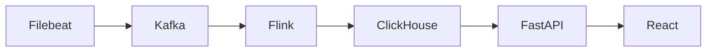

# Log AI Assistant

本项目是一个面向企业安全日志分析的 AI 助手原型。

项目目标是构建从日志采集、结构化处理、ClickHouse 存储、行为基线建模、异常检测、AI 研判反馈到前端工作台的完整安全分析系统。

它将企业安全日志转化为带有规则、行为基线和关联证据的异常事件，供分析人员在统一工作台中研判与追踪。

## 一图看懂



主链路由 Filebeat 采集日志，经 Kafka 和 Flink 规范化后写入 ClickHouse；FastAPI 对外提供业务 API，React 工作台负责展示。ClickHouse 是当前唯一的主存储和分析引擎。

## 5 分钟体验

1. 准备环境并启动完整主链路：

   ```bash
   cp .env.example .env
   docker compose up --build
   ```

2. 打开 [前端工作台](http://localhost:5173)，查看日志、异常事件、用户画像、AI 研判和安全态势相关页面。
3. 打开 [系统状态接口](http://localhost:8000/api/v1/health)，确认 Kafka、Flink、ClickHouse 等服务状态。默认的 `log-generator` 会向 `logs/` 写入小流量多源样例日志，供主链路处理。

## 验证方式

快速执行项目测试：

```bash
docker compose run --rm tester
```

完整的 Docker 验收命令见 [`docs/11_operations_and_acceptance_spec.md`](docs/11_operations_and_acceptance_spec.md)，包含端到端检查、运营任务和场景评测：

其中 `SKIP_COMPOSE_UP=1 scripts/p0_e2e_check.sh` 是可选的端到端检查，使用 POSIX 环境变量赋值和 Bash 脚本；Windows 用户请在 WSL 或 Git Bash 中执行，不能直接在 PowerShell 中运行。

```bash
docker compose run --rm tester
docker compose up -d --build
SKIP_COMPOSE_UP=1 scripts/p0_e2e_check.sh
docker compose run --rm operations-runner run-once --task data_quality_reconcile
docker compose run --rm operations-runner run-once --task baseline_rebuild
docker compose run --rm operations-runner run-once --task daily_report_generate
docker compose run --rm operations-runner run-once --task scenario_evaluate
```

## 项目范围与 AI 边界

本项目聚焦安全日志采集、结构化处理、行为建模、异常检测、证据化研判和运营验收，不是自主执行安全处置的系统。AI 只对已筛选的高可疑 `AnomalyEvent` 证据包提供研判和建议：它不分析全量原始日志、不单独决定异常是否成立，也不会自主执行封禁、阻断等处置动作。任何可能影响规则或有效 baseline 的反馈，都必须经人工审核并保留审计记录。

## My Contribution / 共创说明

本项目为团队共创项目。我在项目中主要负责 **异常检测链路（A 模块）**，核心工作集中在：

- 将已经标准化入库的 `security_logs` 转换为可供前端、AI 研判和运营日报使用的 `anomaly_events`。
- 设计并实现基于 `RuleEngine` 的异常规则判断，包括登录失败聚集、凭证填充、新来源 IP、非工作时间登录、敏感资源访问、横向移动、大量下载/导出等场景。
- 参与定义异常事件数据结构，覆盖 `risk_level`、`risk_score`、`reason_codes`、`rule_hits`、`baseline_deviations`、`evidence`、`related_event_ids` 和 `ai_status` 等字段。
- 将规则强度、行为基线偏离、敏感行为、事件关联和反馈修正纳入风险评分，让检测结果不只是“命中规则”，而是能解释、能排序、能进入后续 AI 研判。
- 打通 `ClickHouse security_logs -> anomaly-detector -> anomaly_events -> frontend / AI judgement / reports` 的中间链路，支撑团队其他成员的数据展示、研判和闭环反馈工作。

这段工作让我完整参与了一个从日志流处理到安全异常事件建模的后端工程链路，也锻炼了我把规则检测、行为基线、风险评分和可解释证据包结合到实际系统中的能力。

## 当前主链路

Filebeat -> Kafka -> Flink -> ClickHouse -> FastAPI -> React

ClickHouse 是当前唯一主存储和分析引擎。
Elasticsearch 不再作为当前目标形态的一部分。

## 正式目标文档

当前项目目标形态、架构约束、数据契约、行为建模方式、AI 使用边界和最终质量标准以 `docs/` 为准。

建议优先阅读：

- `docs/00_project_baseline.md`
- `docs/02_architecture_overview.md`
- `docs/03_data_contract.md`
- `docs/04_clickhouse_schema.md`
- `docs/05_behavior_modeling_spec.md`
- `docs/06_detection_and_scoring_spec.md`
- `docs/07_ai_judgement_feedback_spec.md`
- `docs/09_data_generation_and_scenarios.md`
- `docs/10_final_quality_criteria.md`
- `docs/11_operations_and_acceptance_spec.md`

## 文档索引

完整文档索引见：

- `docs/README.md`

架构决策记录见：

- `docs/adr/README.md`

## 正式运行环境

项目正式运行环境以 Docker Compose 为准。开发者本机只要求安装：

- Git
- Docker / Docker Compose
- 编辑器
- 浏览器

不要求组员本机安装 Miniconda、Python、Node、Flink、Kafka、ClickHouse 或 Filebeat。本地 Python、Node 或 Conda 环境只能作为个人开发便利，不作为项目正式运行依赖。

## Docker-first 启动

首次启动：

```bash
cp .env.example .env
docker compose up --build
```

如果宿主机配置的 Docker Hub 镜像源不可用，构建可能在 `python:3.11-slim`、`node:20-alpine` 等基础镜像 metadata 阶段失败。此时在 `.env` 中把 `PYTHON_BASE_IMAGE`、`NODE_BASE_IMAGE` 或 `KAFKA_IMAGE`、`CLICKHOUSE_IMAGE`、`FLINK_IMAGE`、`FILEBEAT_IMAGE` 改为当前网络可访问的镜像地址，或改为本机已预拉取并重新 tag 的镜像名。

默认 Compose 会拉起当前正式运行基线中的主要服务：

| 服务 | 作用 | 默认访问 |
| --- | --- | --- |
| `kafka` | 流式传输和缓冲层 | `localhost:9092` |
| `flink-jobmanager` / `flink-taskmanager` | Flink 运行环境 | `http://localhost:8081` |
| `flink-submit` | 提交正式 `raw_logs -> parsed_logs` Flink 作业 | 容器内运行 |
| `clickhouse` | 主存储和分析引擎 | `http://localhost:8123` |
| `clickhouse-migrate` | 幂等应用 ADR-010 等增量表结构 | 一次性容器 |
| `filebeat` | 采集 `logs/*.log` 并写入 Kafka `raw_logs` | 容器内运行 |
| `anomaly-detector` | 持续检测 `security_logs` 并写入 `anomaly_events` | 容器内运行 |
| `backend` | FastAPI API 层 | `http://localhost:8000` |
| `frontend` | React + Vite 工作台 | `http://localhost:5173` |
| `log-generator` | 小规模持续生成多源日志样例 | 写入 `logs/` |

默认启动包含 Flink，以保持正式主链路为 `Filebeat -> Kafka -> Flink -> ClickHouse -> FastAPI -> React`。Elasticsearch 和 Kibana 仅在 `legacy-es` profile 中，不进入默认主链路。

如果 `flink:1.18.1` 在当前网络不可拉取，可以在 `.env` 中把 `FLINK_IMAGE` 改为可访问镜像地址，或先在本机预拉取后重新 tag 为 `flink:1.18.1`。

如果使用 Docker Desktop 或脚本执行“拉取全部服务镜像”，可能会触发 legacy profile 中的服务。只拉取默认运行链路时，显式指定服务更稳：

```bash
docker compose pull kafka kafka-init clickhouse filebeat backend frontend log-generator
docker compose up --build kafka kafka-init clickhouse log-generator filebeat flink-jobmanager flink-taskmanager flink-submit anomaly-detector backend frontend
```

默认日志生成器是小流量开发配置，避免压垮普通开发机。大规模日志生成不随默认启动运行，需要显式启用 profile：

```bash
docker compose --profile scale up --build
```

`scale` profile 默认生成速率为 `25 条/秒`，约 `1500 条/分钟`。按当前多源 JSON 日志平均约 700B/条估算，约等于 `1.5GB/day` 原始日志量；如果需要更贴近 `1GB/day`，可在 `.env` 中设置 `LOG_GENERATOR_SCALE_BATCH_SIZE=17`。

默认启动通过 Flink 作业把 `raw_logs` 规范化成 `parsed_logs`，ClickHouse 通过 Kafka 引擎表把 `parsed_logs` 落入 `security_logs`。

`anomaly-detector` 默认每 1 秒执行一轮、每轮最多读取 2000 条日志，用于跟上 scale profile 的数据速率。若检测仍滞后，可继续调高 `.env` 中的 `ANOMALY_DETECTOR_BATCH_SIZE`。

`anomaly-detector` 在 Compose 持续运行模式下会使用 `ANOMALY_DETECTOR_LOOKBACK_MINUTES` 对最近日志执行启动 warmup：只恢复规则滑动窗口和稳定 anomaly id 去重状态，不把 warmup 期间的历史异常重复写入 `anomaly_events`。

`raw-to-parsed` 仅作为故障隔离或本地 fallback 工具保留在 `fallback` profile 中，不属于默认正式主链路。

测试入口不随默认启动运行，可以按需执行：

```bash
docker compose run --rm tester
```

Elasticsearch / Kibana 仅保留在 `legacy-es` profile 中，供旧代码兼容或迁移对照使用，不属于当前正式主链路。
